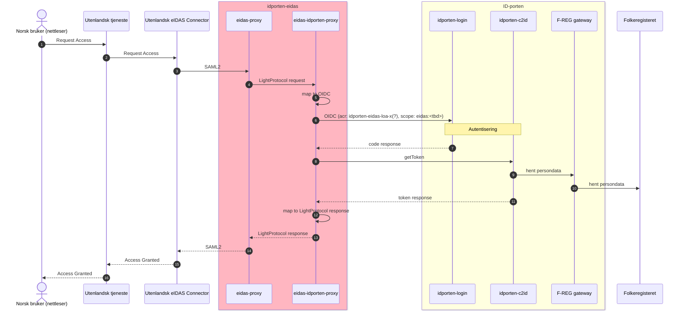
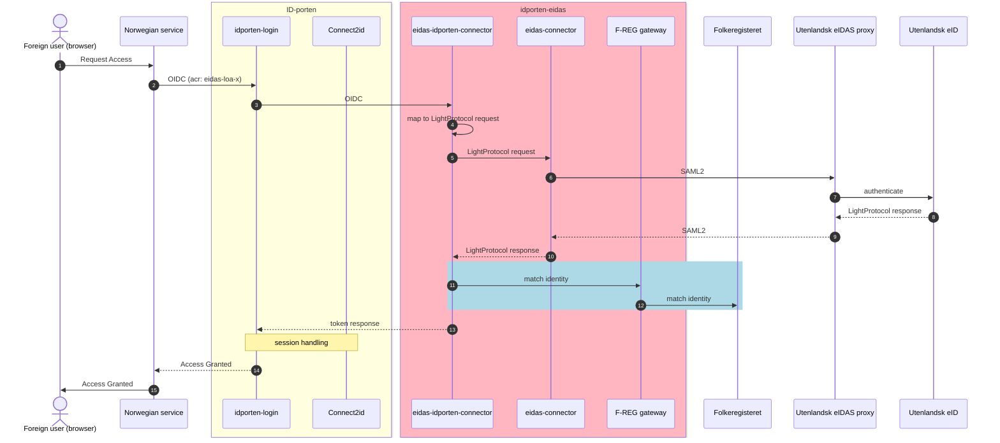

# eidas-demo-countries

eIDAS-node demo-countries CA and CB with applications: proxy/connector/demo-sp/demo-idp for testing purposes.

See these documents in https://ec.europa.eu/digital-building-blocks/sites/display/DIGITAL/eIDAS-Node+version+2.7.1:
* eIDAS-Node Installation Quick Start Guide v2.7.pdf
* eIDAS-Node Installation and Configuration Guide v2.7.1.pdf
* eIDAS-Node Demo Tools Installation and Configuration Guide v2.7.pdf


### Run demo country CA and demo country CB as docker-compose on your machine for local testing

Add the following to your /etc/hosts file:
```
# eIDAS local dev
127.0.0.1 eidas-demo-ca
127.0.0.1 eidas-demo-cb
```
Start docker containers:
```
docker-compose up --build
```
This will run two docker services each with a tomcat instance with all the six EU-war files deployed for running demo country.

To test go to: http://eidas-demo-ca:8080/SP
and choose SP Country: CA and Citizen Country: CB.
Then select "Do not request" in section "Requested core attributes" and show natural person and click as optional or mandatory the 4 required attributes. Then next until reach idp.
Users are listed in <tomcat>/eu-config/idp/user.properties folder in the docker container on format <username>=<passord>. You may start with dim=dim. 

Country CA is on port 8080 and Country CB is on port 8081.

To setup more counties duplicate dev.CB.Dockerfile and modifiy to port for a different country, the eu-config package supports 6 countries: CA, CB, CC, CD, CE, CF.
E.g as listed in eidas-config/sp/sp.properties inside the docker container.

### Run for testing environment
Only demo-country-CA will be build for test environments systest and test.

### Configuration
Is located in the docker folder. 
The default configuration is downloadet from EU site along with the deployment artifacts (wars), but the configuration will be replaced by environment spesific files located in docker/profiles on start up of Tomcat by script addEnvironmentSpesificConfigFiles.sh.
For local development there is set up two countries: CA and CB, but for testing Norwegian eIDAS only one is need and deploy, hence country CA.

### Configuration of trust of Norwegian metadata signing certificate
Import in docker/profiles/<ENVIRONMENT>/keystore/eidasKeyStore.p12 the Norwegian metadata signing certificate. Remove old of naming format norwegian-eidasnode-metadata-<environment>.
Use the program Keystore Exporter or plain java keytool from CMD to import certificate chain to trust.

# Sequence diagrams
The background colors indicates namespace in the Cluster, red is eidas-namespace.
## Norwegian citizen


## Foreign citizen

