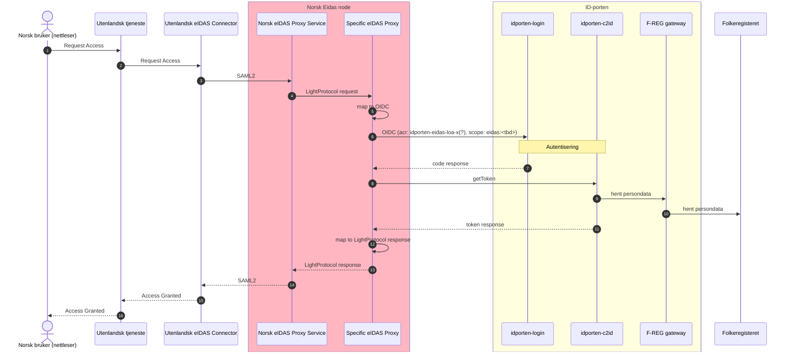
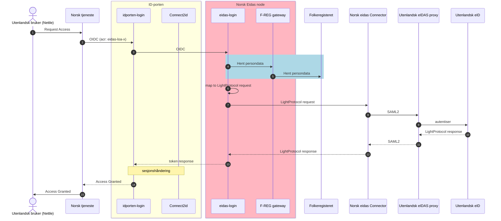

# eidas-node
eIDAS-node with demo-country (eIDAS-proxy/connector/demo-sp/demo-idp)

# Sequence diagrams
## Norwegian citizen

```mermaid  
sequenceDiagram
autonumber
    actor User as Norsk bruker (nettleser)
    participant SP as Utenlandsk tjeneste
    participant UEC as Utenlandsk eIDAS Connector
    box lightpink Norsk Eidas node
    participant NEP as Norsk eIDAS Proxy Service
    participant SEP as Specific eIDAS Proxy
    end
    box lightyellow ID-porten
    participant IL as idporten-login
    participant C2ID as idporten-c2id
    participant FRGW as F-REG gateway
    end
    participant FR as Folkeregisteret

    User->>SP: Request Access
    SP->>UEC: Request Access
    UEC->>NEP: SAML2
    NEP->>SEP: LightProtocol request
    SEP->>SEP: map to OIDC 
    SEP->>IL: OIDC (acr: idporten-eidas-loa-x(?), scope: eidas:<tbd>)
    Note over IL,C2ID: Autentisering
    IL-->>SEP: code response
    SEP->>C2ID: getToken
    C2ID->>FRGW: hent persondata
    FRGW->>FR: hent persondata
    C2ID-->>SEP: token response
    SEP->>SEP: map to LightProtocol response
    SEP-->>NEP: LightProtocol response
    NEP-->>UEC: SAML2
    UEC-->>SP: Access Granted
    SP-->>User: Access Granted
```    

## Foreign citizen

```mermaid  
sequenceDiagram
autonumber
    actor User as Utenlandsk bruker (Nettle)
    participant SP as Norsk tjeneste
    box lightyellow ID-porten
    participant IL as idporten-login
    participant C2ID as Connect2id
    end
    box lightpink Norsk Eidas node
        participant EL as eidas-login
        participant FRGW as F-REG gateway
    end
    participant FR as Folkeregisteret
    participant NEC as Norsk eidas Connector
    participant UPS as Utenlandsk eIDAS proxy
    participant IDP as Utenlandsk eID

    User->>SP: Request Access
    SP->>IL: OIDC (acr: eidas-loa-x)
    IL->>EL: OIDC
    rect lightblue
    EL->>FRGW: Hent persondata
    FRGW->>FR: Hent persondata
    end
    EL->>EL: map to LightProtocol request
    EL->>NEC: LightProtocol request
    NEC->>UPS: SAML2
    UPS->>IDP: autentiser
    IDP-->> UPS: LightProtocol response
    UPS-->>NEC: SAML2
    NEC-->>EL: LightProtocol response
    EL-->>IL: token response
    Note over IL,C2ID: sesjonshåndering
    IL-->>SP: Access Granted
    SP->>User: Access Granted
```    
